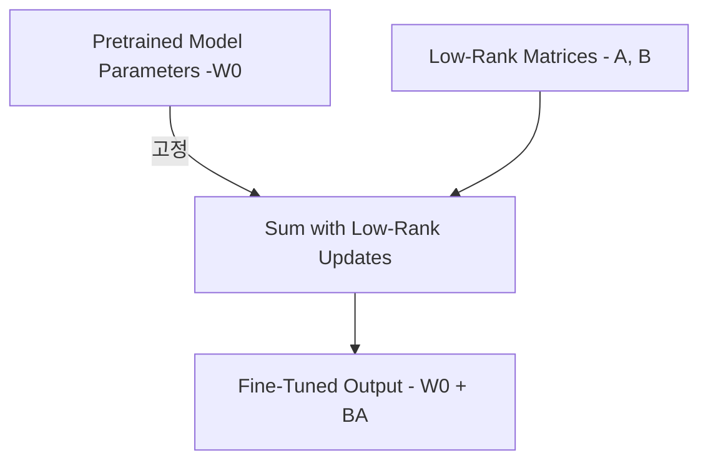

# 📑 LoRA: Low-Rank Adaptation of Large Language Models 요약

## 1. 소개 (Introduction)

- **문제**: 대규모 모델(GPT-3 175B 등)의 풀파인튜닝은 너무 많은 자원 소모
- **LoRA 제안**: Pretrained 모델의 가중치는 고정하고, 각 레이어에 작은 Low-Rank 행렬(A, B)을 삽입하여 학습
- **주요 효과**: 학습 파라미터 수 10,000배 절감, 메모리 사용 3배 절감, 성능은 풀파인튜닝과 동등하거나 우수

## 2. 문제 정의 (Problem Statement)

- 기존 풀파인튜닝: 모든 모델 파라미터 업데이트 → 저장/운영 비효율
- LoRA: ∆Φ를 소수 파라미터(Θ)로 재구성하여 학습 비용 및 스토리지 절감

## 3. 기존 방법론 한계 (Aren't Existing Solutions Good Enough?)

| 방법 | 한계 |
|:---|:---|
| Adapter Layers | 추가 레이어로 인해 추론 지연 증가 |
| Prompt 튜닝 | 최적화 난이도 높고, 입력 시퀀스 길이 감소 |

## 4. LoRA 방법론 (Our Method)

- **Low-Rank Update**: 기존 Weight(W0)에 대해 W0 + BA 형식으로 업데이트 (r ≪ d)
- **Training**: A, B만 학습, W0는 고정
- **Inference**: W0 + BA를 병합하여 별도 지연(latency) 없이 사용 가능

### Transformer 적용
- Wq, Wv 매트릭스에 LoRA 적용 (Self-Attention 부분)
- 학습 중 VRAM 최대 2/3 절감, 저장공간 10,000배 절감 가능

## 5. LoRA 전체 구조 그림

- W0은 고정되어 있고, A와 B(저차원 행렬)만 학습하여 최종 Weight(W0 + BA) 생성

## 6. 실험 결과 (Empirical Experiments)

| 모델 | 결과 |
|:---|:---|
| RoBERTa base/large | GLUE benchmark에서 기존 방법 대비 우수 성능 |
| DeBERTa XXL | 초대형 모델에서도 성능 유지 |
| GPT-2 Medium/Large | 자연어 생성(E2E, WebNLG, DART) 성능 향상 |
| GPT-3 175B | WikiSQL, MNLI, SAMSum에서 풀파인튜닝과 비슷하거나 더 나은 성능 |

## 7. 관련 연구 (Related Works)

- Adapter Layers, Prompt Tuning 방법들과 비교
- LoRA는 추가 추론 지연 없이 성능을 유지한다는 점이 차별화 포인트

## 8. Low-Rank 업데이트에 대한 심층 분석

- **적용 대상**: Wq, Wv 매트릭스에 적용할 때 가장 좋은 성능
- **적절한 Rank**: r=4 정도면 대부분 좋은 성능 (GPT-3 175B 실험)
- **∆W와 W의 관계**: ∆W는 W의 보조적인 방향을 증폭하는 역할

## 9. LoRA vs Adapter vs Prefix Tuning 비교

| 방법 | 학습 파라미터 수 | 추론 속도 | 입력 변경 여부 | 장점 |
|:---|:---|:---|:---|:---|
| Full Fine-Tuning | 전체 | 느림 | 변경 없음 | 최고 성능 |
| Adapter Layers | 적음 | 다소 느림 | 변경 없음 | 효율적, 구조 단순 |
| Prefix Tuning | 매우 적음 | 빠름 | 입력 길이 증가 | 극단적 효율성 |
| **LoRA** | 매우 적음 | 빠름 | 변경 없음 | 효율 + 지연 없음 |

> ✅ LoRA는 추론 시간에 영향을 거의 주지 않으면서 학습 효율을 높이는 최고의 타협안으로 평가됩니다.

## 10. 결론 및 미래 연구 방향

- **LoRA**는 대규모 모델 적응을 위한 강력하고 효율적인 방법
- 향후 방향: 다른 압축/튜닝 기법과 결합, Task-specific 매트릭스 선택 자동화 연구 예정

---

# 📌 최종 요약 키워드

- Low-Rank Adaptation
- PEFT (Parameter Efficient Fine Tuning)
- Memory Efficiency
- Transformer Fine-Tuning
- Adapter vs Prefix vs LoRA 비교

---

