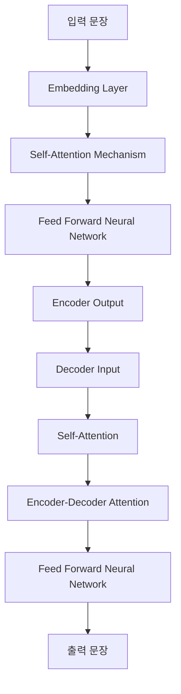
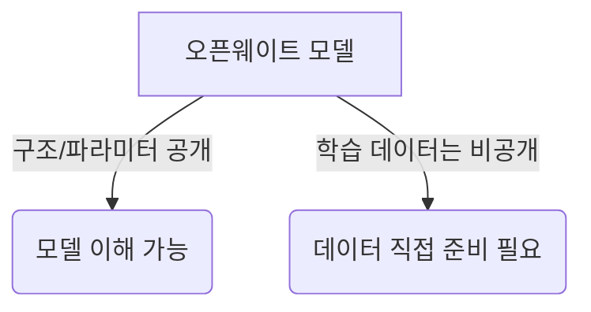
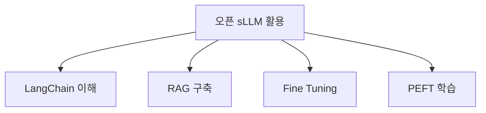

# Chapter 1: Introduction

## 📖 개요

본 챕터에서는 대규모 언어 모델(LLM)과 AI 시대의 흐름을 소개하고, Transformer 구조를 기반으로 한 현대 LLM의 발전 과정과 오픈웨이트(Open-Weight) 모델의 의미와 중요성을 다룹니다. 또한, sLLM(Small LLM) 개념과 한국어 특화 모델, 그리고 오픈모델 사용 시 주의해야 할 라이선스 이슈에 대해서도 설명합니다.

---

## 1.1 AI 시대의 도래

| 주요 사건 | 설명 |
|:---|:---|
| 2024 노벨 물리학상 | 딥러닝 연구자 수상 |
| 2024 노벨 화학상 | 단백질 구조 예측 AI 'AlphaFold' 수상 |

> **트렌드**: 모든 산업에서 AI 활용이 빠르게 확산, 문제 해결 능력 고도화 진행 중.

## 1.2 Transformer와 LLM의 탄생

- **BERT**: Encoder만 사용 → 문맥 이해
- **GPT**: Decoder만 사용 → 문장 생성

> 참고: [Attention is All You Need 논문](https://arxiv.org/abs/1706.03762)

## 1.3 GPT 모델

- **GPT (Generative Pre-trained Transformer)**
  - 2018년 OpenAI 발표
  - 순차적(next token prediction) 방식으로 다음 단어 예측

## 1.4 파운데이션 모델과 LLM

- **파운데이션 모델**: 초거대 파라미터 기반, 다양한 작업을 범용적으로 수행.
- **LLM**: 번역, 요약, 질의응답 등 다용도 사용.

## 1.5 주요 상용 LLM 소개

| 모델 | 파라미터 수 | 특징 | 컨텍스트 길이 | 멀티모달 지원 |
|:---|:---|:---|:---|:---|
| OpenAI GPT-4o | 수백억+ | 이미지, 음성, 추론 모두 강력 | 수십만 토큰 | O |
| Google Gemini 2.0 | 1-2M 토큰 | 긴 컨텍스트, 강력한 멀티모달 | 1-2M 토큰 | O |
| Anthropic Claude 3.5 | 수십억+ | Artifact 생성, 고급 추론 | 수십만 토큰 | X |

## 1.6 오픈웨이트(Open-Weight) LLMs

- Meta Llama 3.1 405B: GPT-4o 초기 모델 수준 도달

## 1.7 오픈모델의 이점

| 이점 | 설명 |
|:---|:---|
| 프라이버시 | 민감 데이터 자체 서버 처리 |
| 비용 절감 | API 호출 비용 없이 고정비 가능 |
| 파인 튜닝 | 맞춤형 모델로 최적화 가능 |
| 안정성 | 외부 API 장애에도 자립 가능 |

## 1.8 과정 목표

## 1.9 sLLM(Small Large Language Models)

| 모델 | 파라미터 수 |
|:---|:---|
| Gemma 2 | 9B |
| Qwen 2.5 | 7B |
| Llama 3.1 | 8B |
| SmolLM2 | 1.7B |

> **특징**: CPU/온디바이스 환경 최적화

## 1.10 오픈 LLM의 중요 요소

### 모델 크기 vs 요구 VRAM

| 모델 크기 | VRAM 요구량 (대략) |
|:---|:---|
| 7B | 14GB |
| 32B | 64GB |

> 추가 학습 시 메모리 4~6배 증가 예상.

### 한국어 성능

- **우수 모델**: Qwen 2.5, Gemma 2
- **리더보드**:
  - W&B 호랑이 리더보드
  - LogicKor Leaderboard (종료)

### 라이선스 주의사항

| 모델 | 상업적 이용 제약 |
|:---|:---|
| Qwen 2.5 | 3B/72B 모델 주의 필요 |
| Llama 3 시리즈 | MAU 7억 이상 제한 |

## 1.11 국내 주요 오픈 모델

| 모델 | 특징 |
|:---|:---|
| Upstage SOLAR Pro 22B | 상업적 사용 가능, 고성능 |
| LG-AI EXAONE 3.5 | 한국어 특화, NC 라이선스 (비상업적 사용)

---

> 다음 Chapter에서는 **LangChain** 프레임워크를 심층적으로 다루겠습니다.

---

# 📌 요약 키워드

- Transformer
- GPT
- Open LLM
- sLLM
- Fine Tuning
- RAG
- LangChain

---

✅ 다이어그램과 표를 추가하여 이해를 더욱 쉽게 구성했습니다.
✅ 다음 챕터로 넘어가거나, 추가 요청 사항을 알려주세요!
