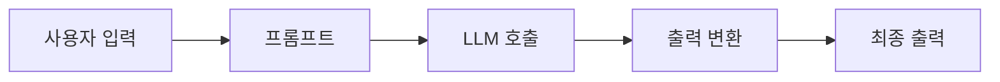

# Chapter 2: LangChain

## 📖 개요

본 챕터에서는 **LangChain** 프레임워크의 개념과 구조를 학습합니다.
LangChain을 이용해 다양한 LLM 어플리케이션을 쉽게 구축할 수 있으며,
효율적인 체인 구성과 외부 도구 활용 방법을 다룹니다.


---

## 2.1 LangChain이란?

| 항목 | 설명 |
|:---|:---|
| 정의 | LLM 기반 어플리케이션 개발을 돕는 오케스트레이션 프레임워크 |
| 핵심 목표 | 기능 추가가 아니라, **효율적인 추상화** 제공 |
| 주요 기능 | 프롬프팅, 메모리 관리, 외부 API 연계, 에이전트 구성 |

> **주요 개념**: 다양한 LLM + 툴 + 데이터 소스를 손쉽게 연결하는 플랫폼


## 2.2 LangChain 기본 구성



- **프롬프트(Prompt)**: LLM에 입력할 명령문 설계
- **LLM**: 다양한 오픈/상용 LLM 호출 가능
- **파서(Parser)**: LLM 출력 결과를 구조화 (JSON, 텍스트 등)
- **툴(Tool)**: 검색, 계산, API 호출 등 기능 추가 가능
- **메모리(Memory)**: 대화 상태 관리


## 2.3 LangChain 주요 라이브러리

| 라이브러리 | 기능 |
|:---|:---|
| LangSmith | 실시간 트래킹, 디버깅, 평가 지원 (LLMOps) |
| LangGraph | 워크플로우 & 에이전트 구축을 위한 플로우 관리 |
| LangServe | LangChain 앱을 API 서버로 배포 |


## 2.4 LangChain + HuggingFace 연동

- HuggingFace의 다양한 오픈 모델 활용 가능
- `langchain-huggingface` 패키지 제공

```python
from langchain.llms import HuggingFaceHub

llm = HuggingFaceHub(repo_id="google/flan-t5-large", model_kwargs={"temperature":0.7})
```

> HuggingFace Hub와 직접 연동하여 커스텀 모델 서빙 가능


## 2.5 LangChain 어플리케이션 구성 예시

```mermaid
graph TD
UserInput[사용자 입력] --> PromptStep[Prompt Template 생성]
PromptStep --> LLMInvoke[LLM 호출]
LLMInvoke --> ParsingStep[출력 파싱]
ParsingStep -->|필요시| OptionalFunction[함수 호출 (Tool)]
OptionalFunction -->|옵션| FinalLLM[추가 LLM 호출]
FinalLLM --> FinalOutput[최종 응답]
ParsingStep -->|또는| FinalOutput
```

- 체인은 다음과 같은 순서로 구성됩니다:
  1. **Prompt Template 작성**: 입력값을 프롬프트 형식에 맞게 변환
  2. **LLM 호출**: 변환된 프롬프트를 모델에 입력하여 응답 생성
  3. **출력 파싱**: 필요한 경우 출력 결과를 JSON, 텍스트 등 원하는 포맷으로 변환
  4. **함수 호출 (옵션)**: 검색, 계산 등의 외부 기능 실행
  5. **추가 LLM 호출 (옵션)**: 후처리나 추가 답변 보강
  6. **최종 응답 출력**: 사용자에게 결과 제공

> **주의**: 각 단계는 명확하게 설계되어야 하며, LLM 출력이 예상 포맷을 따르지 않는 경우 예외 처리가 필요할 수 있습니다.

- **실제 어플리케이션 구성 시 고려사항**:
  - 프롬프트 엔지니어링 중요성
  - 입력/출력 형식 일관성 유지
  - 오류 발생 시 적절한 Fallback 처


## 2.6 LCEL (LangChain Expression Language)

- LangChain 체인 연결을 직관적으로 표현하는 언어
- 파이프 `|`를 사용하여 체인 연결

```python
chain = PromptTemplate | LLM | OutputParser
response = chain.invoke({"input": "Tell me a joke"})
```

- `invoke()`로 전체 체인 실행


## 2.7 주요 Runnables

| 컴포넌트 | 설명 |
|:---|:---|
| Prompt | 입력 템플릿 생성 |
| LLM | 모델 호출 |
| Parser | 출력 포맷 변환 |
| RunnablePassthrough | 입력을 그대로 다음 단계로 전달 |
| RunnableParallel | 여러 Runnable을 병렬 실행 후 결과 취합 |


## 2.8 LangChain 주요 활용 예시

### 🔹 문서 요약 챗봇
- 사용자 질문 → 관련 문서 검색 → 요약하여 답변

### 🔹 외부 API 연결 챗봇
- 사용자 질문 → OpenWeatherMap API 호출 → 날씨 정보 제공

### 🔹 멀티모델 파이프라인
- OpenAI GPT 호출 → 결과를 HuggingFace 모델로 추가 처리


## 2.9 실습: 간단한 문서 검색 챗봇 만들기

```python
from langchain.prompts import PromptTemplate
from langchain.llms import OpenAI
from langchain.vectorstores import Chroma
from langchain.embeddings.openai import OpenAIEmbeddings
from langchain.chains import RetrievalQA

# 벡터DB (Chroma) 초기화
db = Chroma(persist_directory="./chroma_db", embedding_function=OpenAIEmbeddings())

# 검색 + QA 체인 구성
retriever = db.as_retriever()
qa_chain = RetrievalQA.from_chain_type(
    llm=OpenAI(),
    chain_type="stuff",
    retriever=retriever
)

# 사용자 질문을 받아 응답 생성
query = "LLM의 정의는 무엇인가요?"
response = qa_chain.run(query)

print("답변:", response)
```

**구성 설명**:
- `Chroma`: 문서 임베딩 저장소로 사용
- `Retriever`: 관련 문서를 검색
- `RetrievalQA`: 검색한 문서를 기반으로 답변 생성
- `OpenAI LLM`: 답변 생성 담당


## 2.10 LangChain의 장점

| 장점 | 설명 |
|:---|:---|
| 생산성 향상 | 체계적인 구성으로 빠른 어플리케이션 구축 |
| 확장성 | 다양한 모델, 도구, 데이터 소스 쉽게 연결 가능 |
| 가독성 | LCEL로 코드 간결성 확보 |
| 모니터링 | LangSmith를 통한 실시간 추적 가능 |


---

> 다음 Chapter에서는 **RAG (Retrieval Augmented Generation)** 에 대해 다룹니다. 검색 기반 생성 모델을 어떻게 구축하고 활용하는지 심층적으로 학습합니다.


---

# 📌 요약 키워드

- LangChain
- LCEL (LangChain Expression Language)
- Prompt → LLM → Parser
- Runnables
- LangSmith / LangGraph / LangServe

---

✅ 다양한 표, 다이어그램, 예시 코드를 포함하여 체계적으로 정리했습니다.
✅ 추가로 구체적인 실습 예제나 흐름도를 요청할 수 있습니다!
