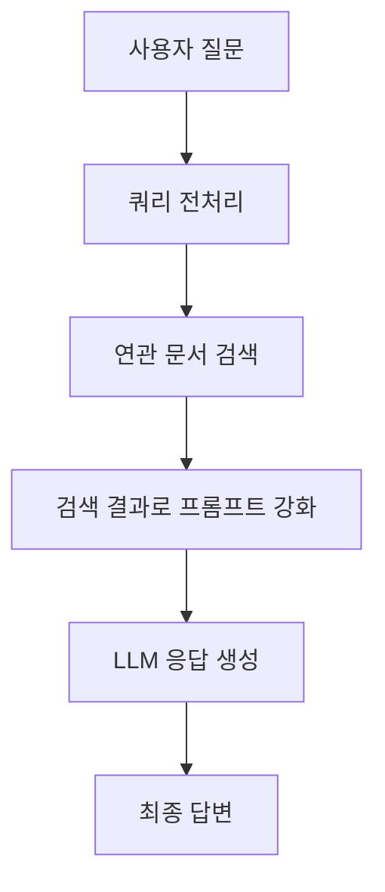
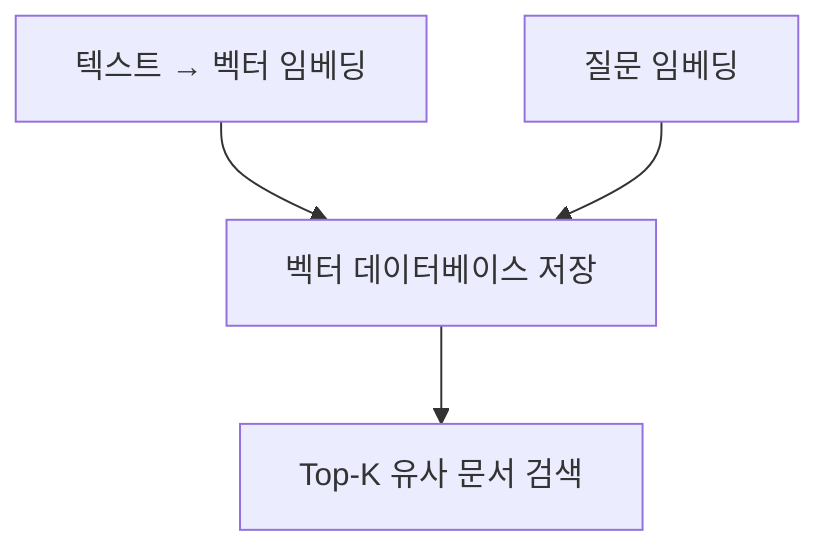
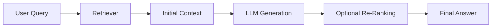

# Chapter 3: RAG (Retrieval Augmented Generation)

## 📖 개요

**RAG**는 Retrieval Augmented Generation의 약자로, 
LLM이 정확하고 신뢰성 있는 답변을 제공하기 위해 외부 지식 데이터베이스를 검색하여 활용하는 기술입니다.

LLM의 한계(지식 부족, 환각 현상)를 보완하는 가장 대표적인 접근 방법입니다.

---

## 3.1 RAG의 필요성

| 문제 | 설명 |
|:---|:---|
| 환각(Hallucination) | LLM이 사실과 다른 내용을 자신 있게 생성 |
| 최신 정보 부족 | 훈련 시점 이후 데이터 반영 어려움 |
| 도메인 한계 | 특정 분야(법률, 금융 등) 지식 부족 |

> ✅ **RAG**는 필요한 정보를 검색하여 프롬프트에 함께 제공, LLM의 답변 정확도를 높여줍니다.


## 3.2 RAG의 기본 구조



**RAG 흐름 요약**:
- 사용자 질문을 전처리
- 연관 문서 검색
- 문서를 기반으로 프롬프트 강화
- 최종 답변 생성


## 3.3 RAG의 5단계 프로세스

| 단계 | 설명 |
|:---|:---|
| 1. Indexing | 지식 문서를 청크(chunk) 단위로 나눠 데이터베이스에 저장 |
| 2. Processing | 쿼리(질문)를 전처리하여 검색 최적화 |
| 3. Searching | 관련 문서를 임베딩(Embedding) 기반으로 검색 |
| 4. Augmenting | 검색 결과를 프롬프트에 추가 |
| 5. Generating | LLM이 최종 답변 생성 |


## 3.4 Indexing: 문서 준비 및 저장

- **청크(Chunking)**: 문서를 작게 나누어 저장
- **적절한 청크 사이즈 선택**이 중요

| 청크 크기 | 장점 | 단점 |
|:---|:---|:---|
| 작음 | 검색 정확도 높음 | 문맥이 부족할 수 있음 |
| 큼 | 문맥 유지 가능 | 불필요 정보 포함 가능 |

> 💡 일반적으로 300~500 토큰(chunk) 크기가 많이 사용됩니다.


## 3.5 Searching: 검색 방법

| 방법 | 설명 |
|:---|:---|
| Semantic 검색 | 문장의 의미를 벡터로 변환 후 유사도 기반 검색 |
| Lexical 검색 | 키워드 일치 기반 검색 (BM25, TF-IDF 등) |
| Hybrid 검색 | Semantic + Lexical 결합 |


### 벡터 데이터베이스 예시

| 벡터DB | 특징 |
|:---|:---|
| Pinecone | 클라우드 기반 대규모 서비스 |
| Chroma | 로컬 사용에 적합, 오픈소스 |
| Milvus, Qdrant, Weaviate | 고성능 무료 벡터 DB 지원 |




## 3.6 Augmenting: 프롬프트 강화

- 검색된 문서를 프롬프트에 삽입하여 LLM이 답변 생성 시 참조하도록 함
- 프롬프트 예시:

```text
다음 정보를 참고하여 질문에 답변하세요.

---

Context:
"'A회사는 1995년에 설립되었고, AI 기술을 전문으로 합니다."

Question:
"A회사는 어떤 분야를 전문으로 하나요?"
```


## 3.7 Generating: 최종 답변 생성

- LLM은 Augmented Prompt를 바탕으로 답변 생성
- 검색 결과 품질에 따라 답변의 정확도도 달라짐


## 3.8 RAG의 주요 고려사항

| 고려사항 | 설명 |
|:---|:---|
| 청킹(Chunking) 전략 | 문서 분리 방법에 따라 검색 품질 영향 |
| 쿼리 전처리 | 의미 있는 검색을 위한 질문 정제 필요 |
| 검색 정확도 | 검색된 문서 품질이 답변 품질을 결정 |
| 프롬프트 구성 | Context 삽입 위치와 양 조절 중요 |


## 3.9 Hybrid Search 최적화 방법

- **Semantic 검색과 Lexical 검색을 동시에 활용**하여 검색 품질 향상

| 전략 | 설명 |
|:---|:---|
| Dual Retrieval | Semantic Top-K와 Lexical Top-K 결과를 합산하여 사용 |
| 재정렬(Re-Ranking) | 초기 검색 결과를 LLM으로 추가 평가하여 순서 조정 |
| Boosting | 특정 키워드 포함 문서에 가중치 부여 |
| MMR(Maximal Marginal Relevance) | 다양성과 관련성 균형 맞추기 |

```text
Hybrid Search 예시 흐름:
1. Semantic 검색으로 10개 검색
2. Lexical 검색으로 5개 검색
3. 두 결과를 통합
4. 유사도 기반 재정렬 후 최종 Top-5 선택
```

> ✅ 다양한 검색 방법을 조합하면 RAG 시스템의 Recall과 Precision을 동시에 향상시킬 수 있습니다.


## 3.10 RAG 평가 지표

| 지표 | 설명 |
|:---|:---|
| Retrieval Recall@k | 질문에 대해 정답이 Top-K 검색 결과에 포함되는 비율 |
| Context Recall | 실제 답변에 필요한 정보가 검색된 문서에 포함되어 있는 비율 |
| Answer F1 Score | 생성된 답변과 정답과의 단어 기반 F1 점수 |
| Faithfulness | 답변이 Context에 충실한 정도 |
| Hallucination Rate | 문맥 외 내용을 생성한 비율 |

> 📊 평가 지표를 활용해 단순 답변 품질 뿐만 아니라, 검색 정확도와 신뢰성을 함께 분석하는 것이 중요합니다.


## 3.11 실습 예제: 간단한 RAG 어플리케이션 구축

```python
from langchain.prompts import PromptTemplate
from langchain.llms import OpenAI
from langchain.vectorstores import Chroma
from langchain.embeddings.openai import OpenAIEmbeddings
from langchain.chains import RetrievalQA

# 벡터DB 초기화 (문서 저장)
db = Chroma(persist_directory="./chroma_db", embedding_function=OpenAIEmbeddings())

# 검색 + QA 체인 구성
retriever = db.as_retriever()
rag_chain = RetrievalQA.from_chain_type(
    llm=OpenAI(),
    chain_type="stuff",
    retriever=retriever
)

# 사용자 질문에 대한 응답 생성
query = "A회사는 어떤 기술을 전문으로 하나요?"
response = rag_chain.run(query)

print("답변:", response)
```

> ✅ 실제 문서를 임베딩하여 검색하고, 검색 결과를 기반으로 답변을 생성하는 기본 구조입니다.


## 3.12 MMR (Maximal Marginal Relevance) 튜닝 방법

- **MMR 목적**: 관련성 높은 결과를 우선하면서도, 유사한 결과끼리는 다양성을 확보

| 파라미터 | 설명 |
|:---|:---|
| Alpha (0~1) | 관련성(Relvance) vs 다양성(Diversity) 간 가중치 비율 |

**MMR Score 계산식**:

```text
MMR = α × 유사도(쿼리, 후보 문서) - (1-α) × 최대 유사도(기존 선택 문서, 후보 문서)
```

- **튜닝 방법**:
  - α=0.7~0.9: 관련성 우선 (기본값 추천)
  - α=0.5 이하: 다양성 우선 (비슷한 답변 방지)
  - **실제 실험 후 최적의 α값**을 찾는 것이 중요

> ✅ 너무 높은 α는 비슷한 결과만 뽑을 수 있고, 너무 낮은 α는 엉뚱한 결과를 섞을 수 있습니다.


## 3.13 다양한 RAG 아키텍처 비교

| 아키텍처 | 특징 | 장단점 |
|:---|:---|:---|
| Standard RAG | 쿼리 → 검색 → 문맥 삽입 → 답변 생성 | 구조 단순, 검색 품질에 따라 답변 품질 결정 |
| RAG-Fusion | 여러 쿼리 변형 → 다중 검색 → 통합 | 검색 Recall 향상, 비용 증가 |
| RAG-Enhanced Generation | 검색+생성 반복 (다단계) | 답변 정밀도 증가, 속도 저하 가능성 |
| RAG with Re-Ranking | 검색 결과를 LLM 기반 재정렬 | 최종 문서 품질 향상, 추가 모델 필요 |
| Multi-Stage RAG | Index → Retrieval → Refinement 단계별 최적화 | 대규모 시스템에 적합, 복잡성 증가 |



> ✅ 프로젝트 요구사항(속도 vs 품질 vs 비용)에 따라 다양한 RAG 아키텍처를 선택하거나 조합할 수 있습니다.


## 3.14 MMR 적용한 Retrieval 예제 코드

```python
from langchain.vectorstores import Chroma
from langchain.embeddings.openai import OpenAIEmbeddings

# 벡터DB 초기화
db = Chroma(persist_directory="./chroma_db", embedding_function=OpenAIEmbeddings())

# MMR 기반 검색기 설정
retriever = db.as_retriever(search_type="mmr", search_kwargs={"k":5, "fetch_k":20, "lambda_mult":0.8})

# 검색 수행
query = "AI 기술 분야에 대해 알려줘"
results = retriever.get_relevant_documents(query)

for doc in results:
    print(doc.page_content)
```

- `fetch_k`: 검색 후보 수
- `k`: 최종 선택 수
- `lambda_mult`: α 값 (관련성 vs 다양성 비율)


## 3.15 RAG 실전 최적화 가이드

| 항목 | 최적화 전략 |
|:---|:---|
| 청킹 크기 | 300~500 토큰 (실험 후 조정) |
| 임베딩 모델 | OpenAI Ada-002, HuggingFace InstructorXL 추천 |
| 검색 방법 | Hybrid 검색 (Semantic + Lexical) 적용 |
| 프롬프트 구성 | Context를 구분선(`---`)으로 명확히 분리 |
| 문서 수 제한 | Top-3 ~ Top-5 문서까지만 삽입 |

> ✅ 메모리 사용량, 검색 속도, 답변 정확도 사이의 균형을 고려하여 설정


## 3.16 하이퍼파라미터 튜닝 정리

| 파라미터 | 설명 | 추천 값 |
|:---|:---|:---|
| Chunk Size | 문서 청크 크기 | 300~500 토큰 |
| Top-k | 검색된 문서 수 | 3~5개 |
| Embedding Dimension | 임베딩 벡터 크기 | 384, 768, 1024 중 선택 |
| Alpha (MMR) | 관련성 vs 다양성 비율 | 0.7~0.9 |
| Max Input Length | LLM 입력 최대 길이 | 4096 이상 권장 |

> ✅ 프로젝트 특성과 모델 스펙에 맞게 실험적으로 튜닝 필요


---

# 📌 추가 요약 키워드

- MMR (Maximal Marginal Relevance)
- Hybrid Search
- Retrieval 최적화
- 하이퍼파라미터 튜닝
- RAG 아키텍처 비교

---
