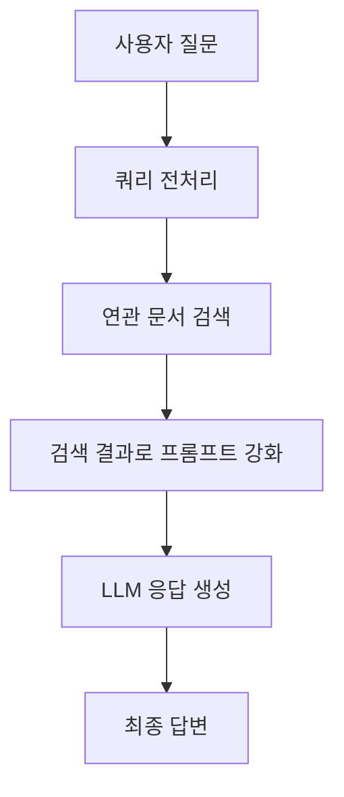
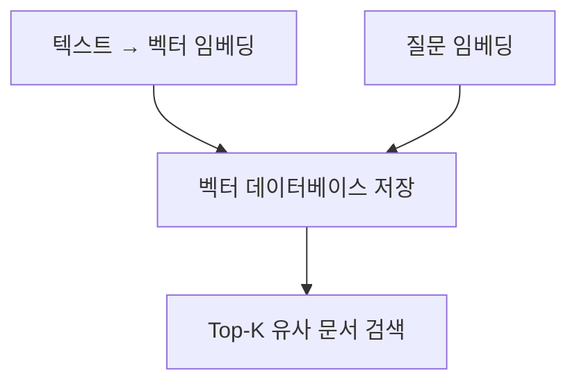

# Chapter 3: RAG (Retrieval Augmented Generation)

## 📖 개요

**RAG**는 Retrieval Augmented Generation의 약자로, 
LLM이 정확하고 신뢰성 있는 답변을 제공하기 위해 외부 지식 데이터베이스를 검색하여 활용하는 기술입니다.

LLM의 한계(지식 부족, 환각 현상)를 보완하는 가장 대표적인 접근 방법입니다.

---

## 3.1 RAG의 필요성

| 문제 | 설명 |
|:---|:---|
| 환각(Hallucination) | LLM이 사실과 다른 내용을 자신 있게 생성 |
| 최신 정보 부족 | 훈련 시점 이후 데이터 반영 어려움 |
| 도메인 한계 | 특정 분야(법률, 금융 등) 지식 부족 |

> ✅ **RAG**는 필요한 정보를 검색하여 프롬프트에 함께 제공, LLM의 답변 정확도를 높여줍니다.


## 3.2 RAG의 기본 구조



**RAG 흐름 요약**:
- 사용자 질문을 전처리
- 연관 문서 검색
- 문서를 기반으로 프롬프트 강화
- 최종 답변 생성


## 3.3 RAG의 5단계 프로세스

| 단계 | 설명 |
|:---|:---|
| 1. Indexing | 지식 문서를 청크(chunk) 단위로 나눠 데이터베이스에 저장 |
| 2. Processing | 쿼리(질문)를 전처리하여 검색 최적화 |
| 3. Searching | 관련 문서를 임베딩(Embedding) 기반으로 검색 |
| 4. Augmenting | 검색 결과를 프롬프트에 추가 |
| 5. Generating | LLM이 최종 답변 생성 |


## 3.4 Indexing: 문서 준비 및 저장

- **청크(Chunking)**: 문서를 작게 나누어 저장
- **적절한 청크 사이즈 선택**이 중요

| 청크 크기 | 장점 | 단점 |
|:---|:---|:---|
| 작음 | 검색 정확도 높음 | 문맥이 부족할 수 있음 |
| 큼 | 문맥 유지 가능 | 불필요 정보 포함 가능 |

> 💡 일반적으로 300~500 토큰(chunk) 크기가 많이 사용됩니다.


## 3.5 Searching: 검색 방법

| 방법 | 설명 |
|:---|:---|
| Semantic 검색 | 문장의 의미를 벡터로 변환 후 유사도 기반 검색 |
| Lexical 검색 | 키워드 일치 기반 검색 (BM25, TF-IDF 등) |
| Hybrid 검색 | Semantic + Lexical 결합 |


### 벡터 데이터베이스 예시

| 벡터DB | 특징 |
|:---|:---|
| Pinecone | 클라우드 기반 대규모 서비스 |
| Chroma | 로컬 사용에 적합, 오픈소스 |
| Milvus, Qdrant, Weaviate | 고성능 무료 벡터 DB 지원 |




## 3.6 Augmenting: 프롬프트 강화

- 검색된 문서를 프롬프트에 삽입하여 LLM이 답변 생성 시 참조하도록 함
- 프롬프트 예시:

```text
다음 정보를 참고하여 질문에 답변하세요.

---

Context:
"'A회사는 1995년에 설립되었고, AI 기술을 전문으로 합니다."

Question:
"A회사는 어떤 분야를 전문으로 하나요?"
```


## 3.7 Generating: 최종 답변 생성

- LLM은 Augmented Prompt를 바탕으로 답변 생성
- 검색 결과 품질에 따라 답변의 정확도도 달라짐


## 3.8 RAG의 주요 고려사항

| 고려사항 | 설명 |
|:---|:---|
| 청킹(Chunking) 전략 | 문서 분리 방법에 따라 검색 품질 영향 |
| 쿼리 전처리 | 의미 있는 검색을 위한 질문 정제 필요 |
| 검색 정확도 | 검색된 문서 품질이 답변 품질을 결정 |
| 프롬프트 구성 | Context 삽입 위치와 양 조절 중요 |


## 3.9 실습 예제: 간단한 RAG 어플리케이션 구축

```python
from langchain.prompts import PromptTemplate
from langchain.llms import OpenAI
from langchain.vectorstores import Chroma
from langchain.embeddings.openai import OpenAIEmbeddings
from langchain.chains import RetrievalQA

# 벡터DB 초기화 (문서 저장)
db = Chroma(persist_directory="./chroma_db", embedding_function=OpenAIEmbeddings())

# 검색 + QA 체인 구성
retriever = db.as_retriever()
rag_chain = RetrievalQA.from_chain_type(
    llm=OpenAI(),
    chain_type="stuff",
    retriever=retriever
)

# 사용자 질문에 대한 응답 생성
query = "A회사는 어떤 기술을 전문으로 하나요?"
response = rag_chain.run(query)

print("답변:", response)
```

> ✅ 실제 문서를 임베딩하여 검색하고, 검색 결과를 기반으로 답변을 생성하는 기본 구조입니다.


---

# 📌 요약 키워드

- Retrieval
- Chunking
- Embedding
- Vector Search
- Contextual Prompting
- Augmented Generation

---

