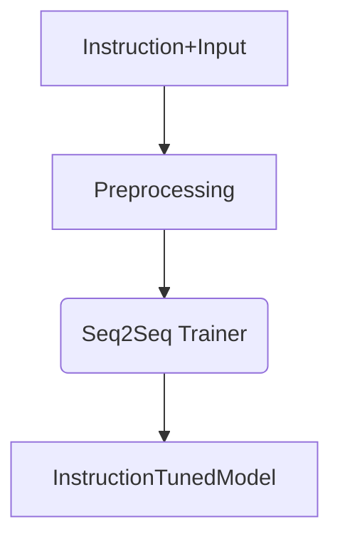
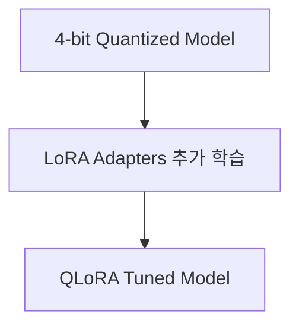

# Chapter 4: Fine Tuning

## 📖 개요

Fine Tuning은 기존에 사전 학습된(Pretrained) LLM 모델에 대해,
특정 도메인이나 작업(Task)에 맞는 추가 학습을 수행하는 과정입니다.

이를 통해 모델이 더 정확하고, 상황에 맞는 답변을 하도록 최적화할 수 있습니다.

---

## 4.1 Fine Tuning이 필요한 이유

| 이유 | 설명 |
|:---|:---|
| 도메인 특화 | 의료, 법률, 금융 등 전문 지식 학습 필요 |
| 스타일 변경 | 답변 톤, 길이, 말투 조정 |
| 성능 향상 | 특정 유형 문제에서 더 높은 정확도 달성 |
| 기능 추가 | 신규 명령/질문 양식에 맞춘 답변 지원 |


## 4.2 Fine Tuning 과정 흐름

```mermaid
graph TD
A[Pretrained Model] --> B[Fine Tuning 데이터 준비]
B --> C[모델 학습 (Fine Tuning)]
C --> D[Fine Tuned Model]
```

**요약**:
- 학습 데이터를 준비한다
- 기존 모델을 기반으로 추가 학습을 수행한다
- Fine-Tuned 모델을 저장하고 배포한다


## 4.3 Fine Tuning 데이터 종류

| 데이터 타입 | 설명 | 예시 |
|:---|:---|:---|
| Corpus 데이터 | 일반 텍스트 코퍼스 | 뉴스, 논문, 위키 문서 |
| QA 데이터 | 질문-답변 쌍 | 고객 지원 FAQ |
| Instruction 데이터 | 명령-응답 형식 | "요약해줘", "코드 작성해줘" |
| Style 데이터 | 말투, 길이 등 스타일 변화 데이터 | 비즈니스 톤 ↔ 캐주얼 톤 변환 |


## 4.4 Fine Tuning 주요 방법

| 방법 | 설명 |
|:---|:---|
| Full Fine Tuning | 전체 모델 파라미터 업데이트 (비용, 메모리 소모 큼) |
| PEFT (Parameter Efficient Fine Tuning) | 일부분만 업데이트 (효율적) |

- 대표적인 PEFT 기법: **LoRA (Low-Rank Adaptation)**


## 4.5 LoRA (Low-Rank Adaptation) 이해

```mermaid
graph TD
W[Pretrained Weights (W)] --> BA[Low-rank Matrix A & B 추가]
BA --> Wnew[Modified Weights (W + BA)]
```

**핵심 아이디어**:
- 기존 가중치 W는 고정
- 작은 행렬(A,B)만 학습하여 효율적 업데이트 수행

| 항목 | Full Fine Tuning | LoRA |
|:---|:---|:---|
| 메모리 소모 | 매우 큼 | 매우 작음 |
| 학습 속도 | 느림 | 빠름 |
| Catastrophic Forgetting 위험 | 있음 | 낮음 |


## 4.6 Fine Tuning 실습 예제 (LoRA 적용)

```python
from peft import LoraConfig, get_peft_model
from transformers import AutoModelForCausalLM, Trainer, TrainingArguments

# 모델 불러오기
model = AutoModelForCausalLM.from_pretrained("facebook/opt-125m")

# LoRA 설정
config = LoraConfig(
    r=8, lora_alpha=16, target_modules=["q_proj", "v_proj"], lora_dropout=0.1, bias="none"
)
model = get_peft_model(model, config)

# 학습 설정
training_args = TrainingArguments(
    output_dir="./lora_ft_model",
    per_device_train_batch_size=4,
    learning_rate=2e-4,
    num_train_epochs=3
)

# Trainer로 학습 진행
trainer = Trainer(
    model=model,
    args=training_args,
    train_dataset=your_train_dataset
)
trainer.train()
```

> ✅ 실제 데이터셋(`your_train_dataset`)을 준비해 학습해야 합니다.


## 4.7 Fine Tuning 최적화 포인트

| 항목 | 전략 |
|:---|:---|
| 학습률 (learning rate) | 2e-4 ~ 5e-5 범위에서 탐색 |
| 배치 크기 (batch size) | 메모리 허용 범위 내 최대값 추천 |
| Epoch 수 | 3~5회 (작은 데이터셋 기준) |
| Early Stopping | 검증 성능 감소시 학습 중단 |

> ✅ 하이퍼파라미터를 조정하며 Overfitting 방지


## 4.8 Fine Tuning 주의사항

- 데이터 품질이 가장 중요 (잘못된 데이터는 성능 악화)
- 너무 많은 Epoch → Catastrophic Forgetting 위험
- LoRA 사용 시, 적절한 `target_modules` 선택 필수 (q_proj, v_proj 등)
- Fine-Tuned 모델은 원본과 별도로 관리


---

# 📌 요약 키워드

- Fine Tuning
- Instruction Tuning
- LoRA (Low-Rank Adaptation)
- PEFT (Parameter Efficient Fine Tuning)
- Catastrophic Forgetting
- 학습 최적화 전략

---

## 4.9 Instruction Tuning 실습 예제

**Instruction Tuning**은 사용자가 입력하는 명령어(instruction)에 대해 모델이 적절하게 응답하도록 학습시키는 방법입니다.

Instruction 데이터셋 예시:

```json
{
  "instruction": "다음 문장을 영어로 번역해줘.",
  "input": "안녕하세요, 좋은 하루 되세요.",
  "output": "Hello, have a nice day."
}
```


### Python 실습 코드 (Instruction Tuning 기반)

```python
from transformers import AutoModelForSeq2SeqLM, Seq2SeqTrainer, Seq2SeqTrainingArguments, AutoTokenizer
from datasets import load_dataset

# 사전학습 모델과 토크나이저 로드
model_name = "google/flan-t5-small"
model = AutoModelForSeq2SeqLM.from_pretrained(model_name)
tokenizer = AutoTokenizer.from_pretrained(model_name)

# 예시 데이터셋 (huggingface/datasets로 대체 가능)
data = [
    {"instruction": "한국어를 영어로 번역해줘.", "input": "안녕하세요.", "output": "Hello."},
    {"instruction": "숫자 2와 3을 더해줘.", "input": "2 + 3", "output": "5"}
]

def preprocess_function(example):
    prompt = f"Instruction: {example['instruction']}\nInput: {example['input']}\nResponse:"
    inputs = tokenizer(prompt, max_length=256, truncation=True)
    labels = tokenizer(example['output'], max_length=256, truncation=True)
    inputs["labels"] = labels["input_ids"]
    return inputs

# 데이터셋 변환
from datasets import Dataset
train_dataset = Dataset.from_list(data)
train_dataset = train_dataset.map(preprocess_function)

# 학습 파라미터 설정
training_args = Seq2SeqTrainingArguments(
    output_dir="./instruction_tuned_model",
    per_device_train_batch_size=4,
    num_train_epochs=3,
    learning_rate=2e-4,
    logging_dir="./logs",
    save_total_limit=1,
    evaluation_strategy="no"
)

# Trainer 설정
trainer = Seq2SeqTrainer(
    model=model,
    args=training_args,
    train_dataset=train_dataset
)

# 학습 시작
trainer.train()
```


### 학습 구조 요약




### 실습 요약

| 항목 | 설명 |
|:---|:---|
| 모델 | Flan-T5-small (Instruction 기반 Pretrained 모델) |
| 입력 | Instruction + Input 조합 |
| 출력 | Response (정답) |
| 방식 | Seq2Seq Fine Tuning |

> ✅ 실제 프로젝트에서는 이 구조를 기반으로 수천~수십만 개의 Instruction 데이터를 이용해 Fine Tuning을 진행합니다.


## 4.10 QLoRA(Quantized LoRA) 소개 및 실습

**QLoRA**는 "Quantized Low-Rank Adaptation"의 약자로, 
모델을 4-bit로 양자화(Quantization)한 후, LoRA로 추가 학습하는 고급 Fine Tuning 기법입니다.

기존 LoRA 대비 **메모리 사용량을 극적으로 줄이면서도** 성능을 유지하거나 향상할 수 있습니다.


### QLoRA 구조 개요



| 항목 | LoRA | QLoRA |
|:---|:---|:---|
| 메모리 절감 | O | ◎ (더 절감) |
| 학습 정확도 | 높음 | 비슷하거나 향상 |
| 연산 속도 | 빠름 | 조금 더 느릴 수 있음 (4bit 연산) |
| 사용 환경 | 24GB VRAM 필요 | 16GB 이하에서도 가능 |


### QLoRA 실습 예제 코드 (최신 Huggingface/PEFT)

```python
from peft import LoraConfig, get_peft_model
from transformers import BitsAndBytesConfig, AutoModelForCausalLM, Trainer, TrainingArguments
from transformers import AutoTokenizer

# 모델 양자화 설정 (bnb_config)
bnb_config = BitsAndBytesConfig(
    load_in_4bit=True,
    bnb_4bit_quant_type="nf4",  # Normal Float 4bit
    bnb_4bit_compute_dtype="bfloat16"
)

# 모델과 토크나이저 로드
model_name = "facebook/opt-125m"
model = AutoModelForCausalLM.from_pretrained(
    model_name,
    quantization_config=bnb_config,
    device_map="auto"
)
tokenizer = AutoTokenizer.from_pretrained(model_name)

# LoRA 설정
config = LoraConfig(
    r=8, lora_alpha=16, target_modules=["q_proj", "v_proj"], lora_dropout=0.1, bias="none"
)
model = get_peft_model(model, config)

# 학습 설정
training_args = TrainingArguments(
    output_dir="./qlora_model",
    per_device_train_batch_size=8,
    learning_rate=2e-4,
    num_train_epochs=3,
    save_total_limit=1,
    logging_dir="./logs",
    optim="paged_adamw_32bit"  # 대규모 양자화 모델 최적화
)

# Trainer로 학습 진행
trainer = Trainer(
    model=model,
    args=training_args,
    train_dataset=your_train_dataset  # 실제 데이터셋 필요
)

trainer.train()
```


### QLoRA 핵심 포인트 요약

| 포인트 | 설명 |
|:---|:---|
| 4-bit 양자화 | VRAM 절감 및 로딩 속도 향상 |
| NF4 포맷 | 4bit 정규화 분포로 양자화하여 정보 보존 |
| bfloat16 연산 | 안정적이고 빠른 4bit 연산 지원 |
| Optimizer | paged_adamw_32bit 최적화기 사용 추천 |

> ✅ QLoRA는 16GB VRAM 노트북/클라우드 환경에서도 대규모 모델 파인튜닝을 가능하게 합니다.


---

# 📌 요약 키워드 (업데이트)

- Fine Tuning
- Instruction Tuning
- LoRA (Low-Rank Adaptation)
- QLoRA (Quantized LoRA)
- 4-bit Quantization
- PEFT

---
