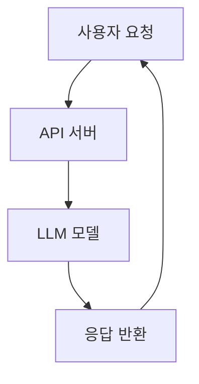

# Chapter 5: Serving / Deployment

## 📖 개요

모델 학습(Fine Tuning)이 완료된 후, 실제 서비스에 모델을 배포(Serving)하는 과정은 매우 중요합니다.
Serving은 사용자가 모델을 쉽게 사용할 수 있도록 **API, 애플리케이션, 시스템** 형태로 제공하는 작업입니다.

---

## 5.1 Serving 방식 종류

| 방식 | 설명 | 장단점 |
|:---|:---|:---|
| 직접 코드 실행 | Python 코드로 직접 모델 로딩 및 요청 처리 | 쉬움, 소규모 테스트에 적합 / 확장성 낮음 |
| Web API 서버 | FastAPI, Flask를 이용해 모델 API화 | 널리 사용, 유연성 높음 |
| 전문 추론 서버 | vLLM, Triton Inference Server 등 활용 | 고성능, 대규모 동시 요청 지원 / 설정 복잡 |


## 5.2 Serving 기본 흐름



**요약**:
- 사용자가 API를 호출
- API 서버가 모델에게 요청 전달
- 모델이 추론 결과를 생성
- API가 응답을 사용자에게 반환


## 5.3 간단한 FastAPI 서버 구축 예제

```python
from fastapi import FastAPI
from pydantic import BaseModel
from transformers import pipeline

app = FastAPI()

# 모델 로딩 (간단한 텍스트 생성)
generator = pipeline("text-generation", model="gpt2")

class Request(BaseModel):
    prompt: str

@app.post("/generate")
async def generate_text(request: Request):
    result = generator(request.prompt, max_length=50)
    return {"result": result[0]["generated_text"]}

# 실행: uvicorn app:app --reload
```

> ✅ FastAPI를 사용하면 모델을 REST API 형태로 간단히 배포할 수 있습니다.


## 5.4 고성능 Serving: vLLM 소개

| 항목 | 설명 |
|:---|:---|
| 특징 | PagedAttention 기반 고속 LLM 추론 엔진 |
| 장점 | 매우 빠른 응답, 메모리 최적화, OpenAI API 호환 |
| 사용 예 | GPU 서버에서 대규모 동시 요청 처리 |


### vLLM 서버 실행 예시

```bash
python3 -m vllm.entrypoints.openai.api_server \
  --model facebook/opt-6.7b \
  --port 8000
```

- 이후 OpenAI API 스타일로 `/v1/chat/completions` 호출 가능!


## 5.5 모델 최적화 기법

| 기법 | 설명 |
|:---|:---|
| Quantization | 모델을 8bit/4bit로 줄여 추론 메모리 절감 |
| Model Parallelism | 여러 GPU에 모델 분산 로딩 |
| Speculative Decoding | 추론 속도 가속 기법 (vLLM 지원) |
| Caching | 같은 입력에 대해 결과 재사용 |

> ✅ 모델 최적화를 통해 Serving 비용과 응답 시간을 줄일 수 있습니다.


## 5.6 실제 배포 고려사항

| 항목 | 설명 |
|:---|:---|
| 스케일링 | 사용량에 따라 인스턴스 자동 확장 (e.g., Kubernetes HPA) |
| 로드 밸런싱 | 여러 서버에 요청 분산 처리 |
| 보안 | 인증/인가, Rate Limit 적용 |
| 모니터링 | 응답 시간, 에러율, 서버 자원 사용량 추적 |


---

# 📌 요약 키워드

- Serving
- API 서버
- FastAPI
- vLLM
- Quantization
- Model Optimization
- 배포 최적화 전략

---

✅ Chapter 5 초안을 체계적으로 정리했습니다: 표, 흐름도, FastAPI/vLLM 예제 포함.
✅ 추가로 "Docker 기반 배포"나 "Streaming Inference 구조" 확장도 가능합니다!
