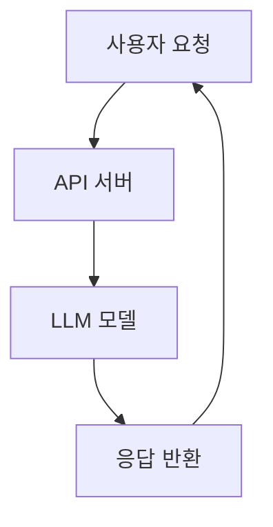
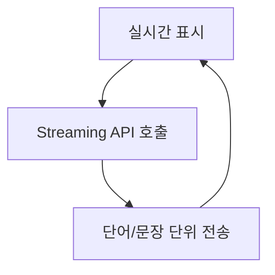
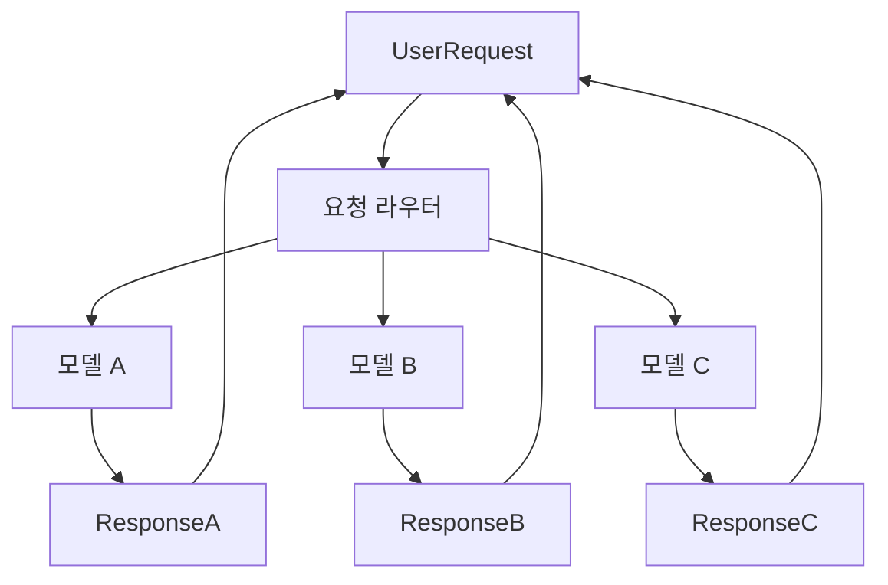

# Chapter 5: Serving / Deployment

## 📖 개요

모델 학습(Fine Tuning)이 완료된 후, 실제 서비스에 모델을 배포(Serving)하는 과정은 매우 중요합니다.
Serving은 사용자가 모델을 쉽게 사용할 수 있도록 **API, 애플리케이션, 시스템** 형태로 제공하는 작업입니다.

---

## 5.1 Serving 방식 종류

| 방식 | 설명 | 장단점 |
|:---|:---|:---|
| 직접 코드 실행 | Python 코드로 직접 모델 로딩 및 요청 처리 | 쉬움, 소규모 테스트에 적합 / 확장성 낮음 |
| Web API 서버 | FastAPI, Flask를 이용해 모델 API화 | 널리 사용, 유연성 높음 |
| 전문 추론 서버 | vLLM, Triton Inference Server 등 활용 | 고성능, 대규모 동시 요청 지원 / 설정 복잡 |


## 5.2 Serving 기본 흐름



**요약**:
- 사용자가 API를 호출
- API 서버가 모델에게 요청 전달
- 모델이 추론 결과를 생성
- API가 응답을 사용자에게 반환


## 5.3 간단한 FastAPI 서버 구축 예제

```python
from fastapi import FastAPI
from pydantic import BaseModel
from transformers import pipeline

app = FastAPI()

# 모델 로딩 (간단한 텍스트 생성)
generator = pipeline("text-generation", model="gpt2")

class Request(BaseModel):
    prompt: str

@app.post("/generate")
async def generate_text(request: Request):
    result = generator(request.prompt, max_length=50)
    return {"result": result[0]["generated_text"]}

# 실행: uvicorn app:app --reload
```

> ✅ FastAPI를 사용하면 모델을 REST API 형태로 간단히 배포할 수 있습니다.


## 5.4 고성능 Serving: vLLM 소개

| 항목 | 설명 |
|:---|:---|
| 특징 | PagedAttention 기반 고속 LLM 추론 엔진 |
| 장점 | 매우 빠른 응답, 메모리 최적화, OpenAI API 호환 |
| 사용 예 | GPU 서버에서 대규모 동시 요청 처리 |


### vLLM 서버 실행 예시

```bash
python3 -m vllm.entrypoints.openai.api_server \
  --model facebook/opt-6.7b \
  --port 8000
```

- 이후 OpenAI API 스타일로 `/v1/chat/completions` 호출 가능!


## 5.5 모델 최적화 기법

| 기법 | 설명 |
|:---|:---|
| Quantization | 모델을 8bit/4bit로 줄여 추론 메모리 절감 |
| Model Parallelism | 여러 GPU에 모델 분산 로딩 |
| Speculative Decoding | 추론 속도 가속 기법 (vLLM 지원) |
| Caching | 같은 입력에 대해 결과 재사용 |

> ✅ 모델 최적화를 통해 Serving 비용과 응답 시간을 줄일 수 있습니다.


## 5.6 실제 배포 고려사항

| 항목 | 설명 |
|:---|:---|
| 스케일링 | 사용량에 따라 인스턴스 자동 확장 (e.g., Kubernetes HPA) |
| 로드 밸런싱 | 여러 서버에 요청 분산 처리 |
| 보안 | 인증/인가, Rate Limit 적용 |
| 모니터링 | 응답 시간, 에러율, 서버 자원 사용량 추적 |


---

# 📌 요약 키워드

- Serving
- API 서버
- FastAPI
- vLLM
- Quantization
- Model Optimization
- 배포 최적화 전략

---
## 5.7 Docker를 이용한 모델 배포

**Docker**는 모델과 서버 코드를 컨테이너로 패키징하여 어디서든 동일한 환경으로 실행할 수 있도록 합니다.

### Dockerfile 작성 예시 (FastAPI + 모델 서버)

```dockerfile
# 베이스 이미지
FROM python:3.10-slim

# 작업 디렉토리 설정
WORKDIR /app

# 필요 패키지 설치
COPY requirements.txt .
RUN pip install --no-cache-dir -r requirements.txt

# 코드 복사
COPY . .

# FastAPI 서버 실행
CMD ["uvicorn", "app:app", "--host", "0.0.0.0", "--port", "8000"]
```

**requirements.txt 예시**:
```text
fastapi
uvicorn
transformers
```

### 빌드 및 실행 명령어

```bash
# Docker 이미지 빌드
docker build -t llm-server .

# Docker 컨테이너 실행
docker run -p 8000:8000 llm-server
```

> ✅ Docker를 사용하면 어디서든 동일한 환경에서 Serving이 가능합니다.


## 5.8 Kubernetes를 이용한 확장형 배포

**Kubernetes**는 컨테이너를 대규모로 관리할 수 있는 플랫폼입니다.

### 기본 구성 요소

| 요소 | 설명 |
|:---|:---|
| Deployment | 컨테이너 애플리케이션 배포 관리 |
| Service | 외부 접근을 위한 네트워크 추상화 |
| HPA (Horizontal Pod Autoscaler) | 부하에 따라 자동 스케일링 |


### 간단한 Deployment YAML 예시

```yaml
apiVersion: apps/v1
kind: Deployment
metadata:
  name: llm-server-deployment
spec:
  replicas: 2
  selector:
    matchLabels:
      app: llm-server
  template:
    metadata:
      labels:
        app: llm-server
    spec:
      containers:
      - name: llm-server
        image: llm-server:latest
        ports:
        - containerPort: 8000
```

### Service YAML 예시

```yaml
apiVersion: v1
kind: Service
metadata:
  name: llm-server-service
spec:
  type: LoadBalancer
  selector:
    app: llm-server
  ports:
    - protocol: TCP
      port: 80
      targetPort: 8000
```

> ✅ Kubernetes를 이용하면 고가용성(HA) 및 자동 복구, 자동 확장이 가능합니다.


## 5.9 Streaming 응답 구조

**Streaming**은 LLM 응답을 한 번에 반환하는 대신, **조각(chunk) 단위로 실시간 전송**하는 방법입니다.

### Streaming이 필요한 이유
- 긴 답변을 빠르게 시작할 수 있음
- 사용자 체감 속도 개선
- 대화형 애플리케이션에서 필수


### FastAPI 기반 Streaming 예제

```python
from fastapi import FastAPI
from fastapi.responses import StreamingResponse

app = FastAPI()

def fake_streaming_response(prompt: str):
    words = prompt.split()
    for word in words:
        yield word + " "

@app.get("/stream")
async def stream_text(prompt: str):
    return StreamingResponse(fake_streaming_response(prompt), media_type="text/plain")
```

### Streaming 구조 흐름



> ✅ FastAPI의 `StreamingResponse`를 사용하면 손쉽게 구현 가능하며, 최신 vLLM, Huggingface Inference Endpoints 등도 streaming을 지원합니다.


---

# 📌 추가 요약 키워드 (Serving 심화)

- Docker
- Kubernetes (K8s)
- Horizontal Scaling
- Streaming Response
- Realtime Inference

---

## 5.10 Multi-Model Serving 구조

**Multi-Model Serving**은 하나의 시스템 또는 서버에서 **여러 개의 모델을 동시에 관리하고 제공**하는 방식입니다.

### 왜 필요한가?
- 다양한 업무(task)에 최적화된 모델 제공 (예: 번역 모델, 요약 모델 분리)
- 리소스 효율화 (모델 크기에 따라 자원 할당)
- 사용자 요구에 따른 유연한 라우팅


### Multi-Model Serving 기본 흐름



- **Router**: 요청을 분석하고 적절한 모델로 전달
- **모델들**: 다양한 목적을 가진 독립 모델 (A, B, C)
- **응답 반환**: 모델별 결과를 사용자에게 반환


### 구현 전략

| 방법 | 설명 |
|:---|:---|
| 단일 서버 멀티 모델 로드 | 메모리가 충분할 경우 하나의 서버에 여러 모델 로딩 |
| 모델별 별도 서버 운영 | 모델 크기가 크거나 부하가 높은 경우 별도 컨테이너로 분리 |
| Gateway/API 라우팅 | FastAPI Router 또는 Kubernetes Ingress Controller 이용


### FastAPI 예제 (간단한 모델 라우팅)

```python
from fastapi import FastAPI
from pydantic import BaseModel

app = FastAPI()

class Request(BaseModel):
    prompt: str
    model_name: str

@app.post("/generate")
async def generate_text(request: Request):
    if request.model_name == "gpt2":
        result = gpt2_pipeline(request.prompt)
    elif request.model_name == "flan-t5":
        result = flan_t5_pipeline(request.prompt)
    else:
        return {"error": "모델을 찾을 수 없습니다."}
    return {"result": result}

# 각각의 pipeline은 사전에 준비되어야 합니다.
```

> ✅ 이처럼 요청 시 model_name에 따라 다른 모델을 호출하는 구조를 쉽게 구현할 수 있습니다.


### 고려사항

| 항목 | 설명 |
|:---|:---|
| 메모리 사용량 | 여러 모델을 로드할 경우 VRAM/메모리 초과 주의 |
| 지연 시간 | 초기 로딩 또는 교체 시 Latency 발생 가능 |
| 버전 관리 | 모델 버전별 구분 필요 (e.g., gpt2-v1, gpt2-v2)
| 모니터링 | 모델별 사용량, 실패율, 응답 시간 추적


---

# 📌 추가 요약 키워드 (Serving 심화2)

- Multi-Model Serving
- Router 기반 모델 분기
- 모델별 리소스 최적화
- FastAPI Routing

---
